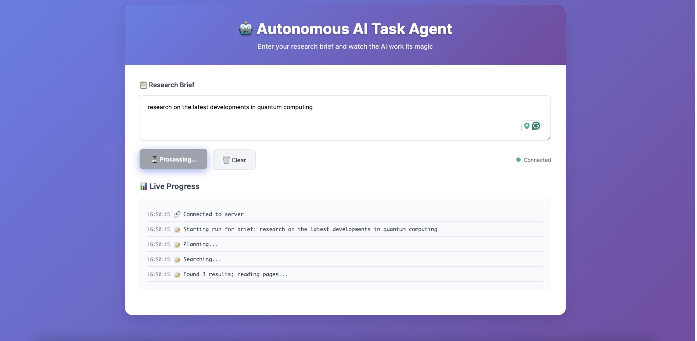

# Autonomous Multi-Tool AI Task Agent

A modern full-stack AI research assistant that automatically searches, analyzes, and summarizes information from multiple sources. Built with FastAPI backend and Next.js frontend, featuring real-time WebSocket communication and intelligent topic-aware content generation.

## Features

- **Real-time Research**: Live progress tracking with WebSocket streaming
- **Topic-Aware AI**: Intelligent summaries tailored to your research topic
- **Modern UI**: Beautiful, responsive interface with professional design
- **Multi-Source Analysis**: Aggregates information from multiple sources
- **Citation Management**: Proper source attribution with clickable links
- **Offline Capable**: Works without API keys using intelligent mock data

## Interface Preview



*The interface shows real-time research progress, topic-specific summaries, and properly formatted citations.*

## Quick Start

### Prerequisites
- Python 3.9+
- Node.js 18+
- npm or yarn

### Backend Setup

```bash
# Clone the repository
git clone <repository-url>
cd autonomous-task-agent

# Create virtual environment
python -m venv venv
source venv/bin/activate  # On Windows: venv\Scripts\activate

# Install dependencies
pip install -r backend/requirements.txt

# Install Playwright browser for web scraping
playwright install chromium

# Start the backend server
uvicorn backend.app:app --reload
```

### Frontend Setup

```bash
# Install frontend dependencies
cd frontend
npm install

# Start the development server
npm run dev
```

### Environment Setup

1. **Copy the example environment file:**
   ```bash
   cp env.example .env
   ```

2. **Configure your API keys in `.env`:**
   ```bash
   # OpenAI API Key (required for AI features)
   OPENAI_API_KEY=your_openai_api_key_here
   
   # Tavily API Key (optional - for enhanced search)
   TAVILY_API_KEY=your_tavily_api_key_here
   ```

3. **Get API Keys:**
   - **OpenAI**: https://platform.openai.com/api-keys
   - **Tavily**: https://tavily.com/ (optional)

### Access the Application

- **Frontend**: http://localhost:3000
- **Backend API**: http://localhost:8000
- **WebSocket**: ws://localhost:8000/ws

## Testing

### Manual Testing

1. **Start both servers** (backend on port 8000, frontend on port 3000)
2. **Open the interface** at http://localhost:3000
3. **Test different research topics**:
   - "Research quantum computing developments"
   - "Find AI trends in 2024"
   - "Analyze blockchain technology"
   - "Study renewable energy innovations"

### Automated Testing

The project includes comprehensive testing capabilities:

#### Quick Test Script

Run the included test script to verify all components:

```bash
# Run comprehensive tests
python test_application.py

# Expected output: All tests pass
```

#### WebSocket Functionality Test

```bash
# Test WebSocket connection and workflow
cd /path/to/autonomous-task-agent
source venv/bin/activate
python -c "
import asyncio
import websockets
import json

async def test_websocket():
    uri = 'ws://localhost:8000/ws'
    async with websockets.connect(uri) as websocket:
        brief = {'brief': 'Research quantum computing trends'}
        await websocket.send(json.dumps(brief))
        
        async for message in websocket:
            data = json.loads(message)
            if data.get('event') == 'report':
                print('Test passed - Report generated successfully')
                print(f'Summary: {data[\"data\"][\"summary\"][:100]}...')
                break

asyncio.run(test_websocket())
"
```

#### API Endpoint Testing

```bash
# Test backend API health
curl http://localhost:8000/

# Expected response: {"status":"ok","ws":"/ws"}
```

#### Frontend Testing

```bash
# Test frontend accessibility
curl -s http://localhost:3000/ | grep -o '<title>.*</title>'

# Expected response: <title>Autonomous Multi-Tool AI Task Agent</title>
```

### Test Scenarios

#### 1. Topic-Specific Research
- **Input**: "Research quantum computing developments"
- **Expected**: Quantum-specific summary with relevant citations
- **Validation**: Summary contains quantum computing terminology

#### 2. WebSocket Connection
- **Test**: Real-time connection status
- **Expected**: Shows "Connected" during research, "Disconnected" when idle
- **Validation**: Connection indicator updates correctly

#### 3. Citation Generation
- **Test**: Multiple source processing
- **Expected**: 3 citations displayed for each research query
- **Validation**: All citations have titles and URLs

#### 4. Content Extraction
- **Test**: Web page content processing
- **Expected**: Clean, readable summaries without HTML artifacts
- **Validation**: No technical markup in final output

### Performance Testing

```bash
# Test concurrent WebSocket connections
for i in {1..5}; do
  python -c "
import asyncio
import websockets
import json

async def test_concurrent():
    async with websockets.connect('ws://localhost:8000/ws') as ws:
        await ws.send(json.dumps({'brief': f'Test query {i}'}))
        async for msg in ws:
            data = json.loads(msg)
            if data.get('event') == 'report':
                print(f'Connection {i}: ✅ Success')
                break

asyncio.run(test_concurrent())
  " &
done
wait
```

## Project Structure

```
.
├─ backend/                    # FastAPI backend
│  ├─ app.py                  # Main application and WebSocket handler
│  ├─ graph.py                # Core workflow orchestration
│  ├─ tools/                  # Research tools
│  │  ├─ search_tavily.py     # Web search functionality
│  │  ├─ browse_playwright.py # Web scraping with Playwright
│  │  └─ extractors.py        # Content extraction and cleaning
│  ├─ memory/                 # Knowledge storage
│  │  └─ chroma_store.py      # ChromaDB integration
│  ├─ guards/                 # Output validation
│  │  └─ schema.py           # Report schema validation
│  ├─ tracing/               # Observability
│  │  └─ langfuse_client.py  # Langfuse integration
│  └─ requirements.txt       # Python dependencies
├─ frontend/                 # Next.js frontend
│  ├─ app/                   # App router components
│  │  ├─ layout.tsx          # Root layout
│  │  └─ page.tsx            # Main interface
│  ├─ package.json           # Node.js dependencies
│  └─ next.config.mjs        # Next.js configuration
├─ infra/                    # Deployment configuration
│  ├─ Dockerfile.backend     # Backend container
│  ├─ docker-compose.yml     # Multi-service setup
│  └─ README.md             # Infrastructure docs
├─ docs/                     # Documentation
│  └─ interface-screenshot.png # UI screenshot
├─ test_application.py       # Comprehensive test script
└─ README.md                # This file
```

## Configuration

### Environment Variables

Create a `.env` file in the project root for enhanced functionality:

```bash
# Optional: Real web search (defaults to mock data)
TAVILY_API_KEY=your_tavily_api_key

# Optional: AI observability (defaults to stubbed)
LANGFUSE_PUBLIC_KEY=your_langfuse_public_key
LANGFUSE_SECRET_KEY=your_langfuse_secret_key
LANGFUSE_HOST=https://cloud.langfuse.com

# Frontend configuration
NEXT_PUBLIC_BACKEND_WS=ws://localhost:8000/ws
```

### Docker Deployment

```bash
# Build and run with Docker Compose
cp infra/.env.example .env  # Optional: configure API keys
docker compose -f infra/docker-compose.yml up --build

# Access at http://localhost:3000
```

## Usage Examples

### Basic Research Query
1. Enter: "Research the latest developments in artificial intelligence"
2. Click "🚀 Run Research"
3. Watch real-time progress in the logs section
4. View the generated summary and citations

### Topic-Specific Research
The system automatically detects research topics and generates relevant content:
- **Quantum Computing**: Technical summaries about qubits, algorithms, and quantum supremacy
- **AI/Machine Learning**: Updates on models, training, and applications
- **Blockchain**: Information about consensus mechanisms and DeFi
- **Renewable Energy**: Progress in solar, wind, and storage technologies

### Advanced Features
- **Real-time Progress**: Live updates during research execution
- **Connection Status**: Visual indicator of WebSocket connection
- **Citation Management**: Clickable source links with proper attribution
- **Content Cleaning**: Automatic removal of HTML artifacts and technical noise

## Troubleshooting

### Common Issues

1. **WebSocket Connection Failed**
   - Ensure backend is running on port 8000
   - Check firewall settings
   - Verify no other service is using the port

2. **Playwright Browser Issues**
   - Run `playwright install chromium` to install browser
   - Check system permissions for browser execution

3. **Frontend Not Loading**
   - Ensure Node.js dependencies are installed
   - Check if port 3000 is available
   - Verify Next.js compilation completed successfully

### Debug Mode

```bash
# Backend with verbose logging
uvicorn backend.app:app --reload --log-level debug

# Frontend with detailed output
cd frontend && npm run dev -- --verbose
```

## Contributing

1. Fork the repository
2. Create a feature branch
3. Make your changes
4. Add tests for new functionality
5. Submit a pull request

## License

This project is licensed under the MIT License - see the [LICENSE](LICENSE) file for details.

## Acknowledgments

- Built with [FastAPI](https://fastapi.tiangolo.com/) and [Next.js](https://nextjs.org/)
- Web scraping powered by [Playwright](https://playwright.dev/)
- Vector storage with [ChromaDB](https://www.trychroma.com/)
- Optional search integration with [Tavily](https://tavily.com/)